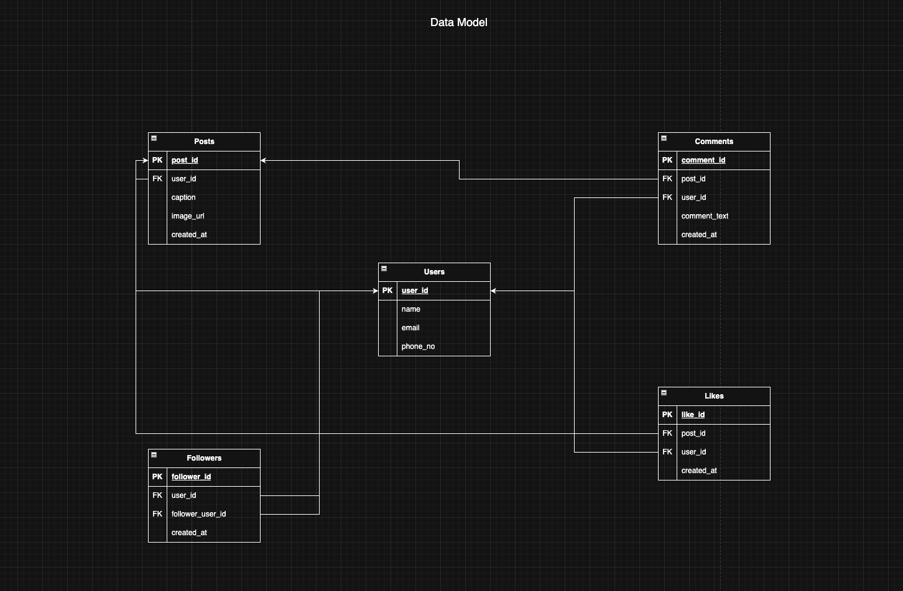

# Photoshare – A Simplified Social Media Database in PostgreSQL

**Photoshare** is a simplified database project inspired by photo-sharing social media platforms. It models core features like users, posts, likes, comments, and followers, and includes analytical SQL queries to explore user engagement and content popularity.

---

## Project Files

- `schema.sql` – Defines all tables with primary and foreign keys
- `insert_data.sql` – Inserts sample/mock data into the tables
- `queries.sql` – Contains analysis and reporting SQL queries
- `data_model.png` – ERD (Entity-Relationship Diagram) of the database

---

## Database Schema Overview

- **Users**: Stores user information such as name, email, and phone
- **Posts**: Represents user-uploaded posts with captions and images
- **Comments**: Allows users to comment on posts
- **Likes**: Tracks likes made by users on posts
- **Followers**: Models follower/following relationships between users

## ERD Diagram

## Sample Queries Included

- Most liked posts and their ranks
- Users who commented on specific posts
- Total number of likes
- Posts with no/low engagement
- Recent posts from the last month
- Posts sorted by creation date

---

## Getting Started

1. Make sure PostgreSQL is installed.
2. Run the following scripts in order:
   - `schema.sql`
   - `insert_data.sql`
   - `queries.sql` (or run queries individually)